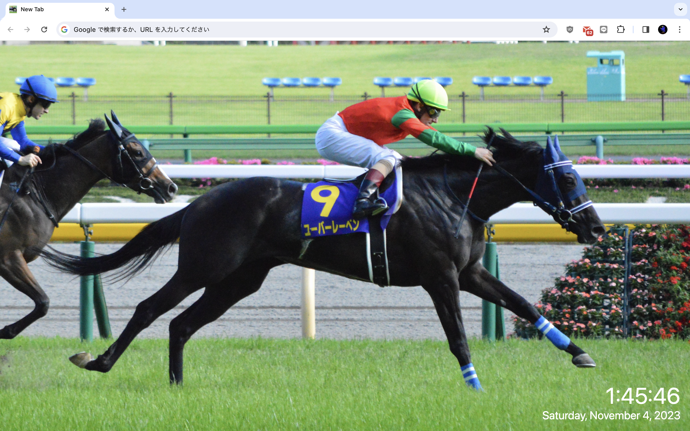

# chrome-horse-wallpaper-extension

A Chrome/Edge extension that displays a random image every time you open a new tab.
This extension has been developed for personal use.



## Overview

- The list of image URLs is managed on the options page and stored in `chrome.storage.sync`.
  - Sync across devices requires installing the extension via Edge Add-ons or Chrome Web Store. With developer mode (unpacked), the extension ID differs per device and sync does not work.
- The options page provides a **link checker** that validates every URL and caches the image data in IndexedDB for instant display on new tabs.
  - Images that fail to load can be removed from the list in one click.
  - Images from hosts that do not support CORS are still displayed normally but cannot be cached (requires `host_permissions`).
- On new tab, a random image is selected. If cached, it is displayed instantly from IndexedDB without a network request. Otherwise it falls back to loading from the original URL.
- The icon was created by DALL-E.

## Installation

### Developer mode (single device)

1. Clone this repository
2. Open `edge://extensions` (Edge) or `chrome://extensions` (Chrome)
3. Enable **Developer mode**
4. Click **Load unpacked** and select the `src/` folder
5. Open the extension's **Options** page
6. Paste your image URLs (one per line) and click **保存** (Save)
7. Click **リンクチェック** (Link Check) to validate and cache all images
8. Open a new tab to see a random image

### Edge Add-ons / Chrome Web Store (multi-device sync)

Publish the extension to a store (unlisted is fine for personal use). Once installed via a store, the extension is automatically installed on other devices signed in with the same browser account, and `chrome.storage.sync` will sync the URL list across them. Image cache (IndexedDB) is per-device; run the link checker on each device once.

## File structure

```
src/
├── manifest.json     # Extension manifest (MV3)
├── newtab.html       # New tab page
├── newtab.js         # Random image selection + cache-first loading
├── options.html      # Options page UI
├── options.js        # URL list editor, link checker, image caching
├── storage.js        # chrome.storage.sync helpers (chunked read/write)
├── imageCache.js     # IndexedDB helpers for image blob cache
├── style.css         # New tab page styles
└── icons/
    └── tab.png       # Extension icon
docs/
├── overview.png      # README preview image
└── origin.png        # Original icon artwork
```
